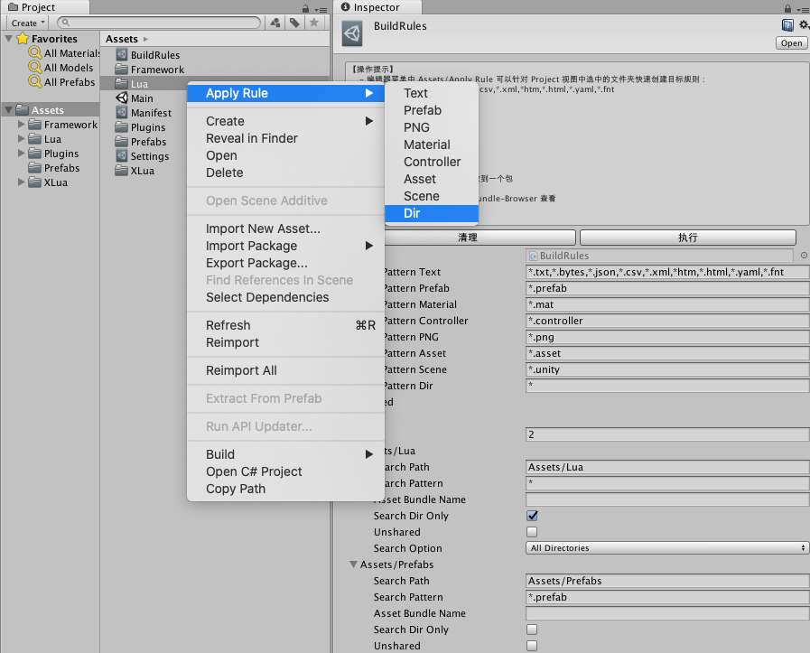

# emo

emo是一个轻量的基于xasset和xLua的gameplay开发框架。借助它可以让你的业务开发或者benchmark节省不少时间。

- GitHub: https://github.com/xasset/emo
- QQ群：693203087

## 功能概览

emo 目前主要为 Unity 项目提供了一个基础的 Lua 业务开发环境，主要提供了：

- 基于 xasset 的资源管理环境，利用最新的BuildRule对预制件和lua脚本进行打包
- 基于 xLua 的 lua 开发环境，并通过基于 xasset 的 LuaManager 接管了对应的 lua 文件加载机制
- 基于 LuaPanda 的 lua 调试环境，在 VSCode 中调试 lua 代码非常方便
- 基于 LuaProfiler的 lua 性能测试环境，可以直接在 Unity 的 Profiler 中分析 lua 代码的性能开销
- 面向状态的 lua 业务开发框架，将游戏的生命周期抽象为其对应的 GameState，让程序业务更有条理
- 在 lua 层提供了业务层同步编码，但底层提供异步资源加载的 View 组件，在减少同步可能导致的卡顿的同时，降低了业务编码难度 

未来，emo 也会会逐步引入代码热更、网络通信、版本更新，序列化等机制，感兴趣的可以先期待下。

## 操作指南

### 启动运行

emo 把 Main 场景，作为程序入口。Main 场景是一个简单的初始场景，位于 Assets 目录，如下：

启动后，通过挂载在场景中游戏对象 Main 上的 Main.cs 让 LuaManager.cs 进行初始化。

初始化主要是给 Lua 环境设置自定义加载器，在常规编辑器环境下，底层是直接通过系统 IO 库读取文件的二进制，在真实的AB加载环境下，则通过 xasset 提供的接口获取目标文件的二进制。

初始化后，LuaManager 会载入 Main.lua，并通过 Main.cs 把 cs 这边的一些主要的事件转发到 Main.Lua，至此，cs 程序的生命周期就与 Lua 环境对接上了。

### 业务开发

emo 的业务开发以 Lua 为主，所有 Lua 代码放在 Assets 目录的 Lua 目录下。在 Lua 层，做业务开发的时候主要需要关注以下三个基础类型：

#### 1.View 

View 是游戏视图的抽象，主要对外提供了创建/关闭/刷新等接口。View 提供了同步编写业务代码，但又在底层进行异步资源加载的机制。目前，工程中主要实现了以下 View：

 * MessageBox 通用对话框 View，可以设置标题、文本，按钮名称事件等
 * LoadingView 带进度条的 View，用来展示读条状态

下面是 MessageBox 和 LoadingView 的使用范例：

```lua
local LoadingView = require 'Logic/Views/LoadingView'
local MessageBox = require 'Logic/Views/MessageBox'
-- ...
function M:OnEnter()
    self.loading = false   

    MessageBox.Show({
        title = 'Prepare to Loading',
        text = '2',
        ensureFunc = function()
            MessageBox.Close()
        end,
        cancelFunc = function()
            MessageBox.Close()
        end,
        closeFunc = function() 
            self.frames = 0
            self.loading = true
        end
    }) 
end

function M:Update()
    if self.loading then
        self.frames = self.frames + 1
        local progress = self.frames / maxframe
        LoadingView.SetProgress(progress, string.format('LOADING ... %.2f%%', progress * 100))
        if self.frames == maxframe then
            self.loading = false
        end
    end
end
-- ...
```

以上代码位于 `Assets/Lua/Logic/States/Loading.lua.bytes` , 运行效果如下图：

#### 2.Action

Action 主要用来处理一些需要更新并有完成条件的业务。

Action 主要需要关注以下接口：

- completed 完成后回调
- updater 每帧调用如果完成返回 true，没完成返回false

对于一个延时调用的 Action 可以这样构造：

```lua
function WaitForSeconds(seconds, completed, updated)
    return Action.new(function(action)
        if updated then
            updated(action)
        end
        return action.elasped >= seconds
    end, completed)
end
```

#### 3.GameState

GameState 描述了程序在某个时间应在做什么，是对游戏生命周期中某个时间的抽象表示。通常，游戏的生命周期可以抽象为多个 GameState，例如：初始化、读条、主界面、副本等。

目前，在 emo 中，主要实现了以下状态：

* Initialize 系统初始化，UIRootView创建
* Loading 读条，处理版本更新，预加载等

如果需要添加新的GameState，也请仿照上面的 GameState 来实现，实现一个具体的 GameState 主要需要关注以下接口：

- OnEnter 进入这个状态该做什么
- OnUpdate 停留在这个状态每帧要做什么
- OnExit 退出这个状态该做什么

以 Initialize 为例，进入状态的时候，主要是把 UIRoot 创建出来，代码如下：

```lua
local M = class('Initialize', GameState)

function M:OnEnter()
    local view = View.new()
    view.onloaded = function(view) 
        Game.ChangeState(GameStateID.Loading)
    end
    view:Load(Res.prefab_uiroot)
end

function M:OnExit()
end

return M
```

上面的代码表示，当 UIRoot 加载出来后就切换当前游戏状态到 Loading 状态，状态切换的过程主要做了两件事：进入要切换的状态，和退出被切换的状态，代码如下：

```lua
function Game.ChangeState(newStateID)
    local stateName = GameStateNames[newStateID]
    local state = Game.states[newStateID]
    if not state then
        state = require("Logic/States/" .. stateName).new()
        Game.states[newStateID] = state 
    end
    local lastState = Game.state 
    if lastState then
        lastState:Exit()
    end
    Game.state = state 
    if state then
        state:Enter()
    end 
    print("[Game]ChangeState", stateName)
end
```

GameState 主要是为了让我们的程序结构变得更有条理也更好维护，对此如果还有疑惑，或许开头那句话句话会对你有帮助：**“GameState 描述了程序在某个时间应在做什么，是对游戏生命周期中某个时间的抽象表示”**。

### 资源打包

#### 基于 BuildRules 的资源打包策略

emo 使用的是 xasset 框架中最新的 BuildRule 来进行资源打包，主要对工程中的 Lua 和 Prefab 添加了对应的打包规则，如下图所示：

如果要添加新的规则，比较快捷的方式是，向上图中一样，在Project视图中选中目标文件夹，然后右键按需选择执行要应用的规则。

#### 其它事项

请参考 ：https://github.com/xasset/xasset

### Lua 调试

请参考：https://github.com/Tencent/LuaPanda

### Lua 性能测试

对于 Lua 的性能测试，emo 主要是集成了 tolua 的 LuaProfiler，可以直接在 Unity 的 Profiler 中查看 lua 的性能开销，Windows 和 Mac 都能用，感觉这样比较方便，运行效果如下：

下面的代码展示了如何在 Unity 的 Profiler 中开启对 lua 的性能开销分析

```lua
require('LuaPanda').start('127.0.0.1', 8818)
require('Init') 

local profiler

function AttachProfiler()
    print("[Main]AttachProfiler")
    if not profiler then
        profiler = require("Profiler")
        profiler:start()
    end
end

function DetachProfiler()
    print("[Main]DetachProfiler")
    if profiler then
        profiler:stop()
        profiler = nil
    end
end

function Main()
    AttachProfiler() -- 在 Unity 的 Profiler 中开启针对 lua 的性能开销分析
    Game.Init()
end
```

对于 Unity 项目的 lua 的性能开销分析，也还有一个对 Windows 开发用户比较好的工具，如果感兴趣，可以去看看这个：https://github.com/ElPsyCongree/LuaProfiler-For-Unity

## 更多框架

- [xasset] https://github.com/xasset/xasset

  一个简易轻量的Unity资源管理框架

- [xLua] https://github.com/Tencent/xLua

   xLua为Unity、 .Net、 Mono等C#环境增加Lua脚本编程的能力，借助xLua，这些Lua代码可以方便的和C#相互调用。

- [TinaX Framework] https://tinax.corala.space/

  “开箱即用”的Unity独立游戏开发工具

- [QFramework] https://github.com/liangxiegame/QFramework

   一套渐进式的快速开发框架

- [ET]https://github.com/egametang/ET

   Unity3D Client And C# Server Framework
   
- [LuaProfiler-For-Unity]https://github.com/ElPsyCongree/LuaProfiler-For-Unity

   Lua Profiler For Unity支持 **XLua**、**SLua**、**ToLua** ，本工具是基于远程Socket的Profiler工具，因此它支持Android，IOS 的真机 Profiler。
